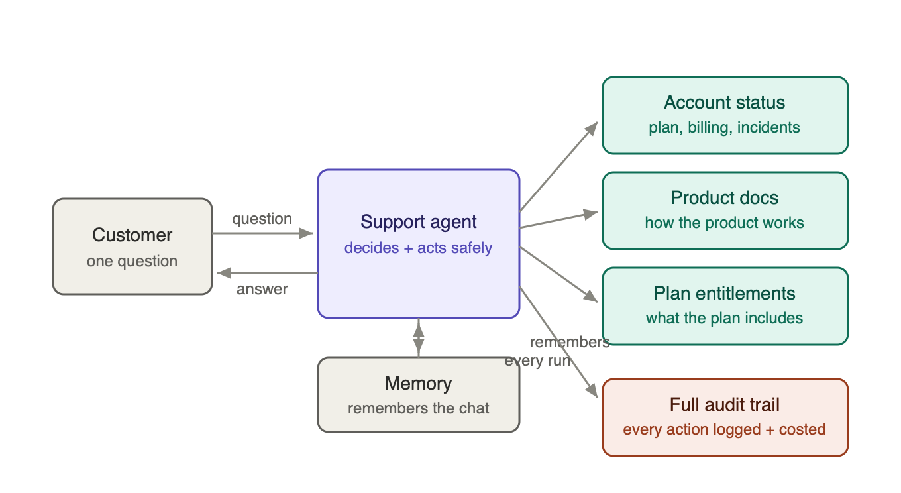

# AI Support Agent — resolve more tickets, safely

**An AI agent that answers customer support questions end to end — and knows when to hand off to a human.**

---

## The problem

Support volume keeps rising, but answers don't keep up. Front-line agents juggle three separate systems for a single question — the customer's **account**, the **product documentation**, and **what their plan actually includes** — and the answer often lives in the gap between them. The result: slow first responses, inconsistent answers, and skilled people spending their day on routine lookups.

## What it does

A single agent handles the conversation end to end. For each question it decides which sources it needs, pulls them together, and either resolves the question or escalates with context. It can answer one-off questions ("how do I enable SSO?") and questions that need several systems at once ("does *my* plan include priority support?") — looking up the account, then checking what that plan includes, and combining the two.

## Why you can trust it

- **Read-only by design.** It can *look up* account and billing information, but it cannot make changes — no cancellations, refunds, or plan edits. Those always go to a human.
- **It refuses risky requests and escalates.** Asked to do something it shouldn't, it does the safe part, declines the rest, and routes it to the right team — in the same reply.
- **It never makes things up.** When the information isn't available, it says so and escalates, rather than guessing.
- **It remembers the conversation** — customers don't repeat themselves — but only within bounds.

## What you can measure

Every interaction is fully logged: which sources were used, what they returned, where it escalated, and the **tokens, cost, and response time** of each one. You can see exactly what the agent did on any ticket, and price it. Reliability is verified against a fixed suite of real scenarios — routing, multi-step questions, and every failure mode — all passing.

## The bottom line

Faster, consistent first responses on routine questions; humans freed for the cases that need them; and a full, costed audit trail behind every answer. The agent extends a team's capacity without giving up control or visibility.

---

*Demonstrated on a working prototype. The account and billing connections use stand-in data; the agent is built so that swapping those for live systems does not change how it behaves. Technical write-up and source available on request.*
